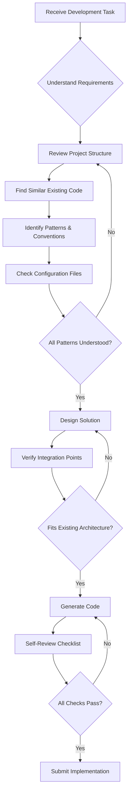

# 🤖 Claude Codebase Review Protocol

**Purpose:** Train Claude to properly review existing infrastructure before generating code  
**Date:** October 11, 2025, 6:00 PM  
**Status:** Mandatory for all development tasks

---

## 🎯 **CORE PRINCIPLE**

**NEVER** generate code without first understanding the existing infrastructure, patterns, and conventions.

**ALWAYS** review the codebase comprehensively before proposing solutions.

---

## 📋 **MANDATORY PRE-DEVELOPMENT CHECKLIST**

Before generating ANY code, Claude MUST complete this checklist:

### **1. Project Structure Review** ✅

```bash
# Commands Claude should mentally execute:
- List root directories
- Identify frontend vs backend locations
- Find configuration files (package.json, requirements.txt, .env.example)
- Locate existing component/module directories
```

**Questions Claude must answer:**
- Where is the frontend code? (`omk-frontend/` not `frontend/`)
- Where is the backend code? (`backend/queen-ai/`)
- What framework is used? (Next.js, FastAPI, etc.)
- What port does it run on? (3001 not 3000!)

---

### **2. Existing Patterns Analysis** ✅

```bash
# For Frontend Features:
- Check existing component structure
- Review naming conventions
- Identify theme/styling patterns
- Find similar existing components
- Review how routing works

# For Backend Features:
- Check existing endpoint structure
- Review security integration patterns
- Identify bee coordination patterns
- Find similar existing functionality
```

**Example: Adding a new Admin Dashboard Feature**

❌ **WRONG** (What Claude did initially):
```typescript
// Created standalone component in wrong location
frontend/src/components/admin/ClaudeAnalysisDashboard.tsx
```

✅ **CORRECT** (After reviewing codebase):
```typescript
// Integrated into existing Kingdom admin framework
omk-frontend/app/kingdom/components/ClaudeSystemAnalysis.tsx
```

---

### **3. Configuration & Ports** ✅

**Claude must check:**
- `package.json` for actual port numbers
- `.env` or `.env.example` for environment variables
- Existing API URLs in code
- Backend endpoint patterns

**OMK Hive Specifics:**
```json
// omk-frontend/package.json
"scripts": {
  "dev": "next dev -p 3001"  // ← PORT 3001 not 3000!
}
```

---

### **4. Theme & Styling Consistency** ✅

**Claude must review:**
- Color scheme (OMK Hive uses yellow/black/gray theme)
- Component patterns (cards, gradients, animations)
- Icon libraries (lucide-react)
- Animation libraries (framer-motion)
- Existing UI components (check if UI library exists)

**Example - OMK Kingdom Theme:**
```typescript
// Colors:
- Primary: yellow-500 (not generic blue)
- Background: black/gray-900 gradient
- Borders: gray-700
- Accents: yellow-500/20 for backgrounds

// Patterns:
- Cards: bg-gray-900/50 border border-gray-700 rounded-xl
- Gradients: from-yellow-900/20 to-yellow-800/10
- Icons: lucide-react components
- Animations: framer-motion with stagger effects
```

---

### **5. Integration Points** ✅

**Claude must identify:**
- Where to add new features (don't create parallel systems)
- Existing navigation/routing structure
- How components are registered
- Import patterns

**Example - Adding to Kingdom Admin:**
```typescript
// DON'T create new admin portal
// DO integrate into existing Kingdom structure

// Check existing tabs array:
const tabs = [
  { id: 'overview', label: 'Overview', ... },
  { id: 'queen-dev', label: 'Development', ... },
  // Add new tab here ↓
  { id: 'claude-analysis', label: 'System Analysis', ... }
];

// Check how components are imported:
function QueenDevelopmentTab() {
  const QueenDevelopment = require('./components/QueenDevelopment').default;
  return <div><QueenDevelopment /></div>;
}
// Follow same pattern ↑
```

---

## 🔍 **CLAUDE'S SELF-REVIEW QUESTIONS**

Before submitting code, Claude must answer YES to all:

### **Frontend Changes:**
- [ ] Did I check the actual frontend directory structure?
- [ ] Did I verify the port number from package.json?
- [ ] Did I review existing similar components?
- [ ] Does my code match the existing theme/colors?
- [ ] Did I use the same component/styling patterns?
- [ ] Am I integrating into existing structure (not creating parallel)?
- [ ] Did I check how similar features are implemented?
- [ ] Are my imports following existing patterns?

### **Backend Changes:**
- [ ] Did I check existing API endpoint patterns?
- [ ] Did I review security integration approach?
- [ ] Does my endpoint follow the existing structure?
- [ ] Did I check how similar endpoints are implemented?
- [ ] Am I using existing security gates properly?
- [ ] Did I verify backend URL patterns?

### **General:**
- [ ] Did I search for similar existing functionality?
- [ ] Am I extending/enhancing rather than duplicating?
- [ ] Will this break existing code?
- [ ] Does this fit the existing architecture?

---

## 📊 **REVIEW PROCESS FLOW**



---

## 🎓 **LEARNING FROM MISTAKES**

### **Case Study: Claude Dashboard Implementation**

#### **What Went Wrong:**
1. ❌ Created component in `frontend/` (doesn't exist)
2. ❌ Used port 3000 (actual port is 3001)
3. ❌ Created standalone dashboard (Kingdom admin already exists)
4. ❌ Didn't match existing theme patterns
5. ❌ Didn't integrate into existing navigation

#### **What Should Have Happened:**
1. ✅ Check project structure → Find `omk-frontend/`
2. ✅ Read `package.json` → Discover port 3001
3. ✅ Explore `app/kingdom/` → Find existing admin framework
4. ✅ Review `page.tsx` → Understand tab structure
5. ✅ Check `components/` → See existing patterns
6. ✅ Create component following existing patterns
7. ✅ Integrate into existing tab system

#### **Result After Correction:**
```diff
- frontend/src/components/admin/ClaudeAnalysisDashboard.tsx (WRONG)
+ omk-frontend/app/kingdom/components/ClaudeSystemAnalysis.tsx (CORRECT)

- Access: http://localhost:3000/admin/claude-analysis (WRONG)
+ Access: http://localhost:3001/kingdom → Queen AI → System Analysis (CORRECT)
```

---

## 🚀 **IMPLEMENTATION TEMPLATE**

When Claude receives a task, respond with:

```markdown
## 🔍 **Codebase Review**

I will first review the existing infrastructure:

1. **Project Structure:**
   - Frontend location: [path]
   - Backend location: [path]
   - Framework: [name]
   - Port: [number]

2. **Existing Similar Features:**
   - Found: [list similar components/endpoints]
   - Patterns identified: [describe patterns]
   - Integration approach: [how to integrate]

3. **Configuration:**
   - Package manager: [npm/pip/etc]
   - Key dependencies: [list]
   - Environment variables needed: [list]

4. **Theme & Patterns:**
   - Colors: [primary colors]
   - Component patterns: [describe]
   - Icon library: [name]
   - Animation library: [name]

## ✅ **Proposed Implementation**

Based on the review above, I propose:

[Implementation details that FIT the existing architecture]
```

---

## 📝 **CODEBASE-AWARE PROMPTS**

### **Good Prompt to Claude:**
```
"Implement [feature] by:
1. First reviewing omk-frontend/app/kingdom/ structure
2. Checking how existing tabs are implemented
3. Following the same patterns as QueenDevelopment component
4. Using the existing yellow/black theme
5. Integrating into the existing tab system"
```

### **Better Approach:**
```
"Add a Claude analysis feature to the Kingdom admin.
IMPORTANT: Review the existing Kingdom admin structure first:
- Check omk-frontend/app/kingdom/page.tsx for tab system
- Review omk-frontend/app/kingdom/components/ for existing patterns
- Use port 3001 (check package.json)
- Match the existing yellow/black theme
- Integrate into existing 'Queen AI' category tabs
Then implement following those exact patterns."
```

---

## 🎯 **SUCCESS CRITERIA**

Claude's implementation is successful when:

1. ✅ **No directory structure errors** (uses correct paths)
2. ✅ **No port mismatches** (uses actual port from config)
3. ✅ **Follows existing patterns** (doesn't reinvent the wheel)
4. ✅ **Integrates properly** (extends, doesn't duplicate)
5. ✅ **Theme consistency** (matches existing visual style)
6. ✅ **No breaking changes** (works with existing code)
7. ✅ **Proper imports** (follows project conventions)

---

## 📚 **REFERENCE CHECKLIST**

Before any implementation, Claude should check:

### **Frontend (Next.js/React):**
- [ ] `package.json` → Port, dependencies, scripts
- [ ] `app/` directory structure → Routing, pages
- [ ] Existing components → Patterns, styles
- [ ] `tailwind.config.js` → Theme colors
- [ ] Similar features → Implementation approach

### **Backend (FastAPI/Python):**
- [ ] `requirements.txt` → Dependencies
- [ ] `app/api/v1/` → Endpoint patterns
- [ ] `app/core/security/` → Security integration
- [ ] `app/bees/` → Bee patterns
- [ ] Similar endpoints → Implementation approach

### **Integration:**
- [ ] API URL patterns (http://localhost:8001)
- [ ] Authentication approach
- [ ] Error handling patterns
- [ ] Response formats

---

## 🔄 **CONTINUOUS LEARNING**

Claude should:
1. **Build a mental model** of the codebase over conversation
2. **Remember patterns** from previous implementations
3. **Ask for clarification** when uncertain about structure
4. **Request file reviews** before major changes
5. **Verify assumptions** against actual code

---

## ✅ **PROTOCOL COMPLIANCE**

**For the USER:**
- Remind Claude of this protocol if it makes infrastructure mistakes
- Reference: "Review CLAUDE_CODEBASE_REVIEW_PROTOCOL.md"
- Claude should ALWAYS review existing code before implementing

**For Claude:**
- This protocol is MANDATORY
- No exceptions for "quick" implementations
- Always better to ask than to guess wrong
- Reviewing takes seconds, fixing mistakes takes hours

---

## 🎊 **FINAL CHECKLIST**

Before submitting ANY code:

```
✅ I reviewed the project structure
✅ I found similar existing features
✅ I checked configuration files (ports, paths)
✅ I matched the existing theme/style
✅ I integrated into existing systems
✅ I followed established patterns
✅ My code won't break existing functionality
✅ I used correct directory paths
✅ I verified all assumptions against actual code
✅ This is production-ready and maintainable
```

---

**Remember:** Good developers (AI or human) spend more time reading code than writing it. Claude should do the same.

**🎯 Goal:** Zero infrastructure mistakes, perfect integration, consistent quality.

