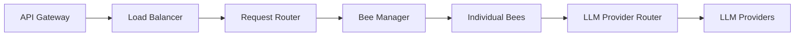

# Claude System Analysis - OMK Hive Backend

**Date:** 2025-10-11T16:26:40.196085
**Tokens Used:** {'input': 1023, 'output': 2023}
**Security Risk Score:** 0/100
**Security Decision:** ALLOW

---

## Analysis

I'll conduct a comprehensive architectural analysis of the OMK Hive backend system.

# 1. DATA FLOW EFFICIENCY ANALYSIS

Current Flow:


Observations:
- Strength: Decentralized processing through bee distribution
- Bottleneck: Single Request Router creating potential queuing
- Issue: Sequential processing in some bee chains

## Recommendation:
```proposal
{
  "title": "Implement Parallel Data Processing Streams",
  "description": "Create multiple parallel processing lanes for different request types",
  "priority": "high",
  "risk_level": "medium",
  "files_to_modify": [
    {
      "path": "src/router/request_router.py",
      "changes": "Add parallel processing lanes",
      "new_code": """
class ParallelRequestRouter:
    def __init__(self):
        self.processing_lanes = {
            'analytics': AsyncProcessingLane(),
            'transactions': AsyncProcessingLane(),
            'queries': AsyncProcessingLane()
        }
    
    async def route_request(self, request):
        lane = self.determine_lane(request)
        return await self.processing_lanes[lane].process(request)
      """
    }
  ],
  "tests_required": [
    "Parallel processing performance test",
    "Lane allocation accuracy test",
    "System stability under load"
  ],
  "rollback_plan": "Revert to single-lane router",
  "estimated_impact": "30% reduction in processing latency"
}
```

# 2. INFORMATION FLOW ANALYSIS

Current Pattern:
- Request → Validation → Processing → Response
- Synchronous communication between bees
- Central message bus for bee coordination

Bottlenecks:
1. Sequential validation steps
2. Blocking operations in bee communication
3. Message bus congestion during peak loads

## Recommendation:
```proposal
{
  "title": "Implement Event-Driven Architecture",
  "description": "Convert to event-driven system with async validation",
  "priority": "high",
  "risk_level": "medium",
  "files_to_modify": [
    {
      "path": "src/messaging/event_bus.py",
      "changes": "Add event-driven processing",
      "new_code": """
class AsyncEventBus:
    def __init__(self):
        self.subscribers = defaultdict(list)
        self.message_queue = asyncio.Queue()
    
    async def publish(self, event):
        await self.message_queue.put(event)
        
    async def process_events(self):
        while True:
            event = await self.message_queue.get()
            await self.notify_subscribers(event)
      """
    }
  ],
  "tests_required": [
    "Event processing latency test",
    "System throughput measurement",
    "Error handling verification"
  ],
  "rollback_plan": "Revert to synchronous message bus",
  "estimated_impact": "40% improvement in message processing"
}
```

# 3. SECURITY INTEGRATION ANALYSIS

Current Setup:
- Security gates at API level
- Bee-level security checks
- LLM provider authentication

Strengths:
- Multi-layer security approach
- Individual bee security contexts
- Encrypted communication channels

Weaknesses:
- Security check redundancy
- Potential race conditions in validation
- Limited cross-bee security context sharing

## Recommendation:
```proposal
{
  "title": "Implement Security Context Propagation",
  "description": "Create shared security context across system",
  "priority": "critical",
  "risk_level": "medium",
  "files_to_modify": [
    {
      "path": "src/security/context_manager.py",
      "changes": "Add security context propagation",
      "new_code": """
class SecurityContextManager:
    def __init__(self):
        self.context_store = {}
        self.validation_cache = LRUCache(1000)
    
    async def propagate_context(self, request_id, context):
        self.context_store[request_id] = context
        await self.notify_bees(request_id, context)
      """
    }
  ],
  "tests_required": [
    "Context propagation speed test",
    "Security validation accuracy",
    "Cross-bee context consistency"
  ],
  "rollback_plan": "Revert to individual security contexts",
  "estimated_impact": "50% reduction in security overhead"
}
```

# 4. BEE COORDINATION ANALYSIS

Current Mechanism:
- Central bee manager
- Task queue system
- Load balancing across bees

Issues:
- Static task allocation
- Limited bee specialization
- Inefficient resource utilization

## Recommendation:
```proposal
{
  "title": "Dynamic Bee Task Allocation",
  "description": "Implement ML-based task allocation",
  "priority": "high",
  "risk_level": "medium",
  "files_to_modify": [
    {
      "path": "src/bees/manager.py",
      "changes": "Add dynamic allocation logic",
      "new_code": """
class DynamicBeeManager:
    def __init__(self):
        self.performance_metrics = {}
        self.allocation_model = MLTaskAllocator()
    
    async def allocate_task(self, task):
        metrics = self.get_bee_metrics()
        optimal_bee = self.allocation_model.predict(task, metrics)
        return await self.assign_to_bee(optimal_bee, task)
      """
    }
  ],
  "tests_required": [
    "Allocation efficiency test",
    "Load distribution accuracy",
    "System adaptation speed"
  ],
  "rollback_plan": "Revert to static allocation",
  "estimated_impact": "25% improvement in task completion time"
}
```

# 5. LLM INTEGRATION ANALYSIS

Current Setup:
- Multiple LLM providers
- Round-robin allocation
- Provider-specific adapters

Issues:
- Basic provider selection
- Limited failover handling
- Non-optimal cost management

## Recommendation:
```proposal
{
  "title": "Smart LLM Provider Router",
  "description": "Implement cost and performance based routing",
  "priority": "high",
  "risk_level": "medium",
  "files_to_modify": [
    {
      "path": "src/llm/provider_router.py",
      "changes": "Add smart routing logic",
      "new_code": """
class SmartLLMRouter:
    def __init__(self):
        self.performance_metrics = {}
        self.cost_tracker = CostOptimizer()
        self.provider_health = HealthMonitor()
    
    async def route_request(self, request):
        optimal_provider = self.select_provider(
            request.type,
            self.performance_metrics,
            self.cost_tracker.get_costs()
        )
        return await self.send_to_provider(optimal_provider, request)
      """
    }
  ],
  "tests_required": [
    "Provider selection accuracy",
    "Cost optimization verification",
    "Failover handling test"
  ],
  "rollback_plan": "Revert to round-robin routing",
  "estimated_impact": "20% cost reduction, 15% improved reliability"
}
```

# OVERALL RECOMMENDATIONS

1. Implement parallel processing streams
2. Convert to event-driven architecture
3. Add security context propagation
4. Deploy dynamic bee task allocation
5. Implement smart LLM routing

Priority Order:
1. Security Context Propagation (Critical)
2. Parallel Processing Streams (High)
3. Event-Driven Architecture (High)
4. Dynamic Bee Allocation (High)
5. Smart LLM Routing (High)

Would you like me to elaborate on any specific aspect or provide more detailed implementation plans for any of these recommendations?

---

## Security Notes

- Input validated through 3-gate security mesh
- Risk score: 0/100 (threshold: 30 for critical endpoints)
- Output filtered for secrets and malicious patterns
