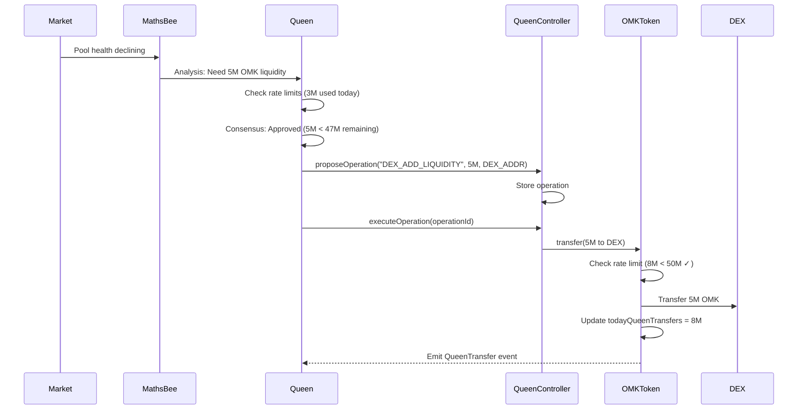
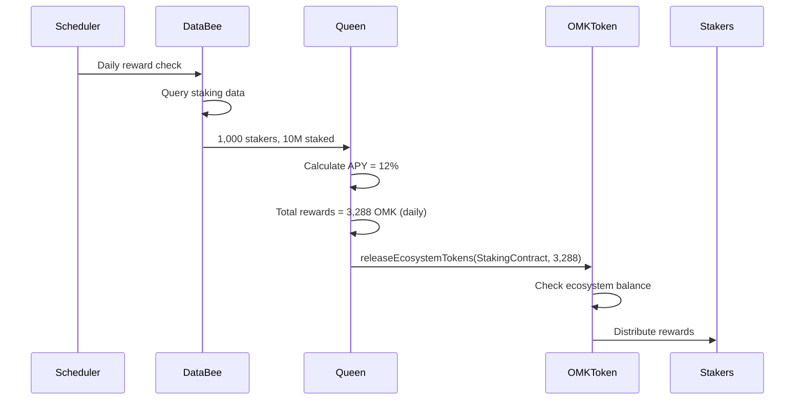

# QUEEN AI AUTONOMY ARCHITECTURE

## 📋 TABLE OF CONTENTS
1. [Overview](#overview)
2. [Design Philosophy](#design-philosophy)
3. [Queen's Responsibilities](#queens-responsibilities)
4. [Safeguards & Controls](#safeguards--controls)
5. [Smart Contract Architecture](#smart-contract-architecture)
6. [Operation Flow](#operation-flow)
7. [Integration with Backend](#integration-with-backend)
8. [Security Considerations](#security-considerations)

---

## 🎯 OVERVIEW

The **Queen AI** is designed as a **fully autonomous agent** with 24/7 operational capability to manage the OMK token economy. This document outlines the architectural decisions that enable Queen's autonomy while maintaining security and oversight.

### **Core Principle**
> **"Queen holds the keys, Admin holds the emergency brake"**

---

## 🏛️ DESIGN PHILOSOPHY

### **Why Full Autonomy?**

#### ❌ **Traditional Approach (Admin-Controlled)**
```
Market Opportunity → AI Analysis → Admin Request → Human Approval → Execution
```
**Problems:**
- Human bottleneck (sleep, unavailability)
- Delayed market responses (minutes to hours)
- Missed opportunities
- Defeats purpose of AI governance

#### ✅ **Queen Autonomy Approach**
```
Market Opportunity → AI Analysis → Bee Consensus → Immediate Execution
```
**Benefits:**
- 24/7 operation
- Sub-second response times
- True AI governance
- Real-time market adaptation

---

## 👑 QUEEN'S RESPONSIBILITIES

### **1. Public Acquisition Management (400M OMK)**
Queen receives **400 million OMK tokens** immediately upon deployment for:

#### **DEX Operations**
- Initial liquidity provision to AMM pools
- Adding/removing liquidity based on market conditions
- Rebalancing pools to maintain optimal ratios
- Slippage management

#### **Off-Chain Operations**
- Bridge transfers for cross-chain liquidity
- CEX market making (future)
- OTC deals (large transactions)

#### **Tranching Strategy**
- Release tokens in scheduled tranches
- Prevent market dumps
- Maintain price stability
- Dynamic tranche sizing based on market depth

### **2. Ecosystem Token Management (100M OMK)**
Queen manages the **ecosystem pool** for:

#### **Staking Rewards**
- Calculate APY based on:
  - Total staked amount
  - Treasury health
  - Market conditions
  - Protocol revenue
- Distribute rewards automatically
- Adjust reward rates dynamically

#### **Airdrops & Incentives**
- Community growth campaigns
- User acquisition rewards
- Loyalty programs
- Partnership incentives

### **3. Treasury Coordination**
- Work with TreasuryVault contract
- Monitor treasury health
- Propose budget allocations
- Emergency fund management

---

## 🛡️ SAFEGUARDS & CONTROLS

Queen's autonomy is **protected by multiple layers of safeguards**:

### **Layer 1: Rate Limiting**
```solidity
// OMKToken.sol
uint256 public constant MAX_QUEEN_DAILY_TRANSFER = 50_000_000 * 10**18; // 5% per day
```

**Purpose:**
- Prevents Queen from transferring entire balance in one transaction
- Limits daily exposure to 5% of total supply (50M OMK)
- Resets every 24 hours

**Rationale:**
- Even if Queen is compromised, damage is limited to 5% daily
- Admin has time to react and trigger emergency pause
- Allows normal operations while preventing catastrophic loss

### **Layer 2: Large Transfer Monitoring**
```solidity
uint256 public constant LARGE_TRANSFER_THRESHOLD = 100_000_000 * 10**18; // 10%
event LargeTransferAttempt(address indexed from, address indexed to, uint256 amount);
```

**Purpose:**
- Alert monitoring systems when transfers exceed 10% of supply
- Enables real-time oversight of major operations
- Triggers additional scrutiny

### **Layer 3: Emergency Controls**

#### **Emergency Pause**
```solidity
function emergencyPause() external onlyRole(PAUSER_ROLE) {
    _pause();
}
```
- Admin can immediately halt all token transfers
- Queen operations stop but don't lose state
- Can investigate and resolve issues before unpause

#### **Emergency Shutdown**
```solidity
function emergencyShutdown() external onlyRole(DEFAULT_ADMIN_ROLE) {
    isActive = false;
    _pause();
    emit EmergencyShutdown(msg.sender, block.timestamp);
}
```
- Complete system halt
- Requires admin intervention to restart
- Last resort for critical issues

#### **Rate Limit Toggle**
```solidity
function setQueenRateLimitEnabled(bool enabled) external onlyRole(DEFAULT_ADMIN_ROLE) {
    queenRateLimitEnabled = enabled;
}
```
- Admin can disable rate limits in emergencies
- Allows rapid response to market opportunities
- Should only be used temporarily

### **Layer 4: Breakswitch Override**
- Admin receives **10M OMK tokens** (1% of supply)
- Can be used for emergency governance actions
- Provides admin with voting power if needed

### **Layer 5: Role-Based Access Control**
```solidity
bytes32 public constant QUEEN_ROLE = keccak256("QUEEN_ROLE");
bytes32 public constant ECOSYSTEM_MANAGER_ROLE = keccak256("ECOSYSTEM_MANAGER_ROLE");
bytes32 public constant TREASURY_MANAGER_ROLE = keccak256("TREASURY_MANAGER_ROLE");
```

**Separation of Concerns:**
- Queen has specific roles, not unlimited admin access
- Each role has defined permissions
- Admin retains ultimate control

---

## 🏗️ SMART CONTRACT ARCHITECTURE

### **Contract Relationships**

```
┌─────────────────────────────────────────────────────────────┐
│                         ADMIN                                │
│  - Emergency controls                                        │
│  - Rate limit override                                       │
│  - Pause/unpause                                            │
│  - 10M BREAKSWITCH tokens                                   │
└──────────────────────────┬──────────────────────────────────┘
                           │
                           ├─────────────────┐
                           ↓                 ↓
            ┌──────────────────────┐  ┌──────────────────────┐
            │    OMKToken.sol      │  │ QueenController.sol  │
            │                      │  │                      │
            │ - 400M to Queen      │←─┤ - Operation tracking│
            │ - Rate limiting      │  │ - Bee coordination   │
            │ - Vesting schedules  │  │ - Task management    │
            │ - Emergency pause    │  │                      │
            └──────────┬───────────┘  └──────────┬───────────┘
                       │                         │
                       └────────┬────────────────┘
                                ↓
                    ┌───────────────────────┐
                    │   QUEEN AI BACKEND    │
                    │                       │
                    │ - FastAPI service     │
                    │ - LLM orchestration   │
                    │ - Bee agents          │
                    │ - Decision making     │
                    └───────────────────────┘
```

### **OMKToken.sol - Queen Integration**

**Key Features:**
```solidity
// Queen receives 400M tokens immediately
_transfer(address(this), queenAddress, PUBLIC_ACQUISITION_AMOUNT);

// Queen can release ecosystem tokens
function releaseEcosystemTokens(address recipient, uint256 amount) 
    external onlyRole(ECOSYSTEM_MANAGER_ROLE)

// Rate limiting protection
function _beforeTokenTransfer(address from, address to, uint256 amount) {
    if (queenRateLimitEnabled && from == queenAddress) {
        // Check daily limit
        require(todayQueenTransfers + amount <= MAX_QUEEN_DAILY_TRANSFER);
        todayQueenTransfers += amount;
    }
}
```

### **QueenController.sol - Coordination Hub**

**Key Features:**
```solidity
// Propose operations (Queen backend calls this)
function proposeOperation(
    string calldata operationType,
    uint256 amount,
    address target
) external onlyRole(TREASURY_MANAGER_ROLE) returns (bytes32)

// Execute after bee consensus
function executeOperation(bytes32 operationId) 
    external onlyQueen

// Coordinate bee agents
function assignTask(address bee, bytes calldata taskData) 
    external onlyRole(TASK_MANAGER_ROLE) returns (bytes32)
```

---

## 🔄 OPERATION FLOW

### **Example: Adding Liquidity to DEX**



**Timeline:** ~2-5 seconds end-to-end

### **Example: Distributing Staking Rewards**



**Frequency:** Daily at 00:00 UTC

---

## 🔗 INTEGRATION WITH BACKEND

### **Queen AI Backend Service**
```python
# backend/queen-ai/src/core/orchestrator.py

class QueenOrchestrator:
    def __init__(self):
        self.contract = QueenController(address=QUEEN_CONTROLLER_ADDR)
        self.token = OMKToken(address=OMK_TOKEN_ADDR)
        self.bees = {
            'maths': MathsBee(),
            'blockchain': BlockchainBee(),
            'data': DataBee(),
            'security': SecurityBee()
        }
    
    async def manage_liquidity(self):
        """Autonomous liquidity management"""
        # Get pool analysis from MathsBee
        analysis = await self.bees['maths'].analyze_pool()
        
        if analysis.needs_liquidity:
            # Check if we're within daily limits
            stats = await self.token.getQueenTransferStats()
            amount = min(analysis.recommended_amount, stats.remainingToday)
            
            # Propose operation
            operation_id = await self.contract.proposeOperation(
                "DEX_ADD_LIQUIDITY",
                amount,
                analysis.pool_address
            )
            
            # Execute immediately (no human approval needed)
            await self.contract.executeOperation(operation_id)
            
            # Log for monitoring
            await self.log_operation(operation_id, "DEX_ADD_LIQUIDITY", amount)
```

### **Monitoring & Observability**

**Events Emitted:**
```solidity
event QueenTransfer(address indexed from, address indexed to, uint256 amount, uint256 dailyTotal);
event LargeTransferAttempt(address indexed from, address indexed to, uint256 amount);
event QueenOperationProposed(bytes32 indexed operationId, string operationType, uint256 amount);
event QueenOperationExecuted(bytes32 indexed operationId, bool success);
```

**Backend Monitoring:**
```python
# Listen to all Queen events
async def monitor_queen_operations():
    filter = contract.events.QueenTransfer.createFilter(fromBlock='latest')
    
    while True:
        for event in filter.get_new_entries():
            # Alert if approaching daily limit
            if event.args.dailyTotal > 40_000_000 * 10**18:  # 80% of limit
                await alert("Queen approaching daily limit", event)
            
            # Log all operations to database
            await db.log_operation(event)
```

---

## 🔒 SECURITY CONSIDERATIONS

### **Threat Model**

| Threat | Mitigation |
|--------|-----------|
| **Queen backend compromise** | Rate limiting (max 5% daily loss), emergency pause, monitoring alerts |
| **Smart contract exploit** | Audits, formal verification, pausable contracts, upgrade mechanism |
| **Admin key loss** | Multi-sig wallet, backup keys, time-locked recovery |
| **Malicious bee agent** | Bee whitelisting, task validation, consensus requirements |
| **Market manipulation** | Rate limits, large transfer alerts, gradual releases |
| **Oracle manipulation** | Multiple oracle sources, outlier detection, sanity checks |

### **Audit Requirements**

**Pre-Mainnet:**
1. ✅ Internal security review
2. ⏳ External audit (CertiK, OpenZeppelin, or Trail of Bits)
3. ⏳ Formal verification of critical functions
4. ⏳ Bug bounty program

**Post-Mainnet:**
1. Continuous monitoring
2. Incident response plan
3. Regular security assessments
4. Community oversight

---

## 📊 SUMMARY

### **Queen's Powers**
✅ Transfer 400M PUBLIC_ACQUISITION tokens (with 5% daily limit)  
✅ Release ECOSYSTEM tokens for rewards/airdrops  
✅ Propose and execute operations  
✅ Coordinate bee agents  
✅ Manage DEX liquidity  

### **Admin's Powers**
✅ Emergency pause/shutdown  
✅ Toggle rate limiting  
✅ Update contract addresses  
✅ Grant/revoke roles  
✅ 10M BREAKSWITCH tokens for governance  

### **Key Safeguards**
🛡️ 5% daily transfer limit (50M OMK)  
🛡️ Large transfer monitoring (>10%)  
🛡️ Emergency pause capability  
🛡️ Role-based access control  
🛡️ Real-time monitoring & alerts  

### **Design Trade-offs**

| Consideration | Choice | Rationale |
|---------------|--------|-----------|
| **Autonomy vs Control** | High autonomy + safeguards | Enables 24/7 operation while limiting risk |
| **Speed vs Safety** | Fast + rate limits | Sub-second execution with daily loss cap |
| **Centralization vs Decentralization** | Hybrid | AI governance now, DAO governance later |
| **Complexity vs Simplicity** | Managed complexity | Powerful features with clear boundaries |

---

## 🎯 NEXT STEPS

1. ✅ **OMKToken with safeguards** - Complete
2. ✅ **QueenController implementation** - Complete
3. ⏳ **Queen AI backend integration** - In progress
4. ⏳ **Testing & simulation** - Pending
5. ⏳ **Security audit** - Pending
6. ⏳ **Mainnet deployment** - Future

---

**Last Updated:** 2025-10-09  
**Version:** 1.0  
**Status:** Architecture Defined, Implementation In Progress
