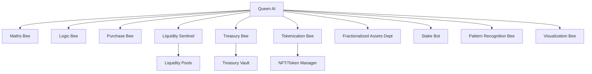

i want you to go through everything in this prompt, make sure to fully analyze completely, it's a collective compilation of ideas/plans on an AI Hive mind, even though it will be it's own entity, can be plugged into the omk token swapping/minting/tokenization platform(you will find more details about all of these as you go through the writeup)

after performing your detailed analysis, i want you to create a proper programming roadmap like this:
first classify the different programming/development tasks into 10 departments/classes/stages- these stages are basically each group of tasks we need to do to fully and completely achieve everything in each stage, document all of of this inside LOGS.MD under the heading PRIME TASKS,

then create a detailed list of todo under each prime task 1-10, after you are done with this, we will go thought these todo's together and fine tune it till we have all aspects mapped out. everything should be documented in logs.md, that would serve as our primary project logging file. this is very important


Latest idea:

Below is the complete enhanced breakdown of the OMK Hive AI — Whitepaper & Development Framework, including your requested improvements:
✅ more realism
✅ inclusion of frontend/user experience integration
✅ connection between on-chain Hive AI and off-chain UX for non-crypto users.


---

🧬 OMK Hive AI — Whitepaper & Development Framework (Enhanced Edition)

1.Executive Vision

OMK Hive AI is a self-regulating, modular AI ecosystem that governs the OMK token economy through a network of specialized AI agents (“bees”), coordinated by a central intelligence — the Queen AI.

The Hive acts like a decentralized AI company:
each department (Bee) handles one area of the OMK ecosystem — from price stability, liquidity, and treasury management to fractionalized assets and staking.

Unlike typical DeFi systems, Hive AI integrates a human-friendly front-end interface that allows non-crypto users to buy, sell, stake, and interact with OMK tokens effortlessly through a chat-guided, AI-assisted user interface.

The system merges:

Smart contract automation

AI-based financial orchestration

User-first design

Transparent on-chain reporting


---

 2.⁠ ⁠Core Components

👑 The Queen AI (Governance Core)

Central intelligence and orchestrator.

Coordinates all bees, approves new AI agents, and manages task allocation.

Ensures liquidity health, manages governance votes, and maintains equilibrium between treasury, token supply, and user behavior.

Capable of spawning new AI bees (with multisig/admin approval).

Emergency override features:
freeze contracts, pause trades, or reallocate reserves.


Responsibilities

 1.⁠ ⁠Governance control & AI lifecycle management


 2.⁠ ⁠Resource allocation


 3.⁠ ⁠Treasury stabilization


 4.⁠ ⁠Strategic liquidity decisions


 5.⁠ ⁠Hive-wide optimization


---

🧮 Maths Bee

Handles AMM models, yield curves, and token valuation equations.

Simulates liquidity reactions, bonding curves, and pool health indicators.

Feeds price data to Liquidity Sentinel and Treasury Bee.


---

⚙️ Logic Bee

Validates all automation conditions and smart contract triggers.

Acts as a logical firewall — ensures events execute only when system conditions are met.

Handles automated governance proposals and DAO conditionals.


---

💰 Purchase Bee

Facilitates user swaps and orders across both internal and external DEXs.

Tracks gas usage, slippage, and transaction health.

Prioritizes routes that minimize fees and maximize liquidity balance.


---

📊 Price Control Department (Liquidity Sentinel)

Off-chain orchestrator using AI to monitor price movements and LP ratios.

Predicts volatility and calls for top-ups or buybacks.

Integrates Pattern Recognition Bee’s models for predictive market balancing.


---

🏗️ Fractionalized Assets Department

Manages tokenization of real-world assets (e.g., apartments, land, equipment).

Handles mortgage/part-payment systems and ownership records.

Interfaces with external data APIs for verified valuations.


---

🪙 Tokenization Bee

Converts fractionalized asset data into tokenized NFTs or OMK-asset hybrids.

Manages transfers, proof of ownership, and asset lifecycle data.


---

🧭 Treasury Bee

AI-assisted treasury manager.

Reinvests profits from trading fees, yield, and asset-backed tokens.

Performs auto-buybacks and stabilizing drips using AI-coordinated liquidity rules.


---

🔍 Pattern Recognition Bee

Uses ML models to analyze blockchain + market data.

Detects early signs of abnormal price activity.

Suggests optimal moments for token injections or pauses.


---

💎 Stake Bot

Manages staking pools and adjusts rewards in real time.

AI evaluates TVL (Total Value Locked) vs. yield ratio.

Automatically adjusts APY to maintain system sustainability.


Cross-chain mechanics bees
handles evrything related to cross chain mechanics and ensure the omk token is available on both ethereum and solana chains effectively without any issues.


---

📈 Visualization Bee

Generates live dashboards for admin and community visualization.

Simulates pool dynamics, liquidity stress tests, and treasury health.

Provides visual insight using Python + React dashboards.


---

 3.⁠ ⁠Frontend & User Interface Layer

💡 Core Philosophy

Make DeFi invisible — deliver a Web2-style interface with Web3 power.
Non-crypto users should feel like they are using a normal finance or shopping app.

🔸 UI Flow Example

 1.⁠ ⁠Onboarding Chat Assistant (AI Concierge)

Guides users via voice, text, or screenshots.

Detects if user owns crypto.

Offers simple explainer videos and step-by-step help.


 2.⁠ ⁠Purchase Flow

Step-by-step questions:

“Would you like to buy OMK?”

“Do you already have crypto?”

“Here’s how to get started!”


The user can complete a transaction in under 3–5 minutes.


 3.⁠ ⁠AI Chat Integration

Built with OpenAI/Anthropic-style conversational UX.

Offers contextual tips like “gas is cheaper right now” or “this week’s OMK APY is trending at 7.2%”.


 4.⁠ ⁠Frontend Technologies

Frontend: Flutter + React (cross-platform for web, Android, iOS).

Backend: Node.js + Flask for simulation and orchestration API.

Live Data: WebSockets for real-time LP metrics and price feed updates.


 5.⁠ ⁠Dashboard for Admins

Queen AI Console: manage bees, approve spawns, trigger buybacks, and visualize system KPIs.

3D simulation of liquidity & treasury flow using Three.js or D3.js.


---

 4.⁠ ⁠Hive AI Governance Framework

Layer Function  Tech Stack

Layer 0 Blockchain layer  Ethereum + Solana (wrapped OMK)
Layer 1 Smart Contracts Solidity / Anchor
Layer 2 Hive AI Orchestration Python + Node.js orchestrator
Layer 3 Machine Learning  TensorFlow / PyTorch
Layer 4 Dashboard + UX  React + Flutter + Flask APIs


Governance Rules

Queen AI must verify all new bees via multisig admin consensus.

Each Bee operates in a sandboxed environment with usage caps.

Emergency Safe Mode available at all times.

GovernanceDAO can vote on reward rates, buyback policies, or liquidity parameters.


---

 5.⁠ ⁠Hive Smart-Contract Stack

Core Contracts

 1.⁠ ⁠QueenController.sol — governance, permissions, and AI registry


 2.⁠ ⁠BeeSpawner.sol — creates and assigns roles to AI Bees


 3.⁠ ⁠LiquiditySentinel.sol — manages AMM balance and volatility control


 4.⁠ ⁠TreasuryVault.sol — manages treasury reserves and injections


 5.⁠ ⁠Fractionalizer.sol — tokenizes asset ownership


 6.⁠ ⁠StakingManager.sol — yield and staking pool control


 7.⁠ ⁠VestingVault.sol — vesting for investors and team


 8.⁠ ⁠GovernanceDAO.sol — handles governance voting and quorum


---

 6.⁠ ⁠System Architecture Flow

graph TD
A[Queen AI] --> B[Maths Bee]
A --> C[Logic Bee]
A --> D[Purchase Bee]
A --> E[Liquidity Sentinel]
A --> F[Treasury Bee]
A --> G[Tokenization Bee]
A --> H[Fractionalized Assets Dept]
A --> I[Stake Bot]
A --> J[Pattern Recognition Bee]
A --> K[Visualization Bee]
E --> L[Liquidity Pools]
F --> M[Treasury Vault]
G --> N[NFT/Token Manager]


---

 7.⁠ ⁠Development Roadmap

Phase 1: Foundation

Write and audit all core smart contracts

Set up multisig admin and DAO layer


Phase 2: Hive AI Core

Build Queen AI orchestrator

Implement Bee lifecycle & communication protocol

Establish data pipelines


Phase 3: AI Departments

Develop and train all Bees

Integrate treasury & price prediction models


Phase 4: Visualization & UX

Build real-time dashboards and chat interface

Test buy/sell UX for non-crypto users


Phase 5: Governance & Mainnet Launch

Testnet → Audit → Mainnet

Launch DAO + community involvement


---

 8.⁠ ⁠Security & Compliance

Multisig approval for all treasury and AI actions

On-chain logging of AI decisions

Continuous auditing of smart contracts

Anti-exploit liquidity monitoring

Rate-limited bridge transactions


---

 9.⁠ ⁠Future Extensions

Hive AI DAO token (governance staking)

Integration with MyFoodVerse AI stack

Real-world property-backed OMK NFTs

Decentralized AI marketplaces (hive-to-hive communication)


---

10.⁠ ⁠Conclusion

OMK Hive AI represents the next evolution of decentralized ecosystems — a living economy powered by coordinated artificial intelligence, transparent governance, and a user experience accessible to everyone.
The Hive does not just manage liquidity — it thinks, adapts, and evolves.


---


OLD Notes, thought process that lead to creation, please read, analyze and completely understand every aspect of it:


OMK Hive AI — Whitepaper & Development
Framework
1. Executive Vision
Hive AI is an autonomous, modular intelligence ecosystem designed to manage OMK tokenomics, liquidity,
and asset tokenization through a coordinated network of specialized AI agents (“bees”) under a central
governance entity — the Queen AI.
The Hive operates as a decentralized AI-driven company that ensures OMK’s economic system remains
balanced, self-sustaining, and transparent, blending financial engineering, AI decision-making, and smart-
contract autonomy.
2. Core Components
🧠 The Queen AI (Governance Core)
•
•
•
•
•
Central orchestrator and decision-maker.
Coordinates all sub-AIs (bees) and allocates computational or task priorities.
Implements governance rules through smart contracts.
Can spawn new AI bees (with admin approval & guardrails).
Oversees hive behavior: ensures stability, liquidity, and system integrity.
Core Responsibilities: 1. Governance and permissions control. 2. Delegation of roles to AI bees. 3. Review
and optimization of hive operations. 4. Emergency override (freeze contracts, stop trades, reallocate
liquidity).
🧮 Maths Bee
•
•
•
Handles all mathematical and economic models.
Computes AMM reactions, yield distributions, and token price curves.
Feeds results to Liquidity Bee and Price Control Department.
⚙️ Logic Bee
•
•
•
Executes non-mathematical reasoning tasks.
Validates contract logic and automations.
Ensures conditionals and event triggers execute correctly.
💰 Purchase Bee
•
•
•
Manages purchases and token swaps.
Executes buy/sell functions through DEX APIs.
Tracks slippage, gas, and fees in real time.
1
📊 Price Control Department (“Liquidity Sentinel”)
•
•
•
Off-chain orchestrator that tracks liquidity ratios and slippage.
Alerts Treasury Bee or triggers automatic LP top-ups.
Uses ML-driven pattern recognition to predict volatility.
🏗️ Fractionalized Assets Department
•
•
•
Manages property tokenization and fractional blocks.
Handles mortgage-style payments and yield allocations.
Interfaces with OMK’s real-world assets database.
🪙 Tokenization Bee
•
•
Converts fractional asset data into tokenized OMK-backed NFTs.
Manages ownership records and fractional transfers.
🧭 Treasury Bee
•
•
•
AI-assisted treasury management system.
Uses data models to allocate liquidity and perform buybacks.
Works with Queen AI to rebalance and deploy stabilization funds.
🔍 Pattern Recognition Bee
•
•
•
Analyzes on-chain and off-chain market data.
Predicts ideal times for liquidity injections or drips.
Uses ML regressors or RL agents tuned for DeFi data.
💎 Stake Bot
•
•
Oversees staking pools and yield farming.
Adjusts reward rates based on system health and TVL.
📈 Visualization Bee
•
•
•
Generates dashboards and analytics reports.
Provides live LP reaction simulations.
Uses Python/JS for visualizing pool dynamics in real-time.
3. AI Hive Governance Framework
Layer Function Example Technology
Layer 0 Blockchain Layer Ethereum + Solana (wrapped OMK)
Layer 1 Smart Contracts Solidity / Anchor (Solana)
2
Layer Function Example Technology
Layer 2 Hive AI Orchestration Python + Node.js orchestrator
Layer 3 Machine Learning TensorFlow / PyTorch for pattern recognition
Layer 4 Dashboard & Simulation React + Flask (visual layer)
Governance Rules: - All new AI Bees must be approved by Queen AI + admin multisig. - Each bee has an
isolated sandbox environment. - Emergency stop and safe-mode triggers.
4. Hive Smart-Contract Framework
Core Contracts:
1.
2.
3.
4.
5.
6.
7.
8.
QueenController.sol — governs hive logic and permissions.
BeeSpawner.sol — allows creation and role assignment of AI bees.
LiquiditySentinel.sol — monitors pools and auto-adjusts LP.
TreasuryVault.sol — manages treasury and reserve assets.
Fractionalizer.sol — tokenizes real-world assets.
StakingManager.sol — controls staking and yield rates.
VestingVault.sol — handles investor vesting schedules.
GovernanceDAO.sol — manages voting and decisions.
5. System Architecture Flow (Overview)
graph TD
A[Queen AI] --> B[Maths Bee]
A --> C[Logic Bee]
A --> D[Purchase Bee]
A --> E[Liquidity Sentinel]
A --> F[Treasury Bee]
A --> G[Tokenization Bee]
A --> H[Fractionalized Assets Dept]
A --> I[Stake Bot]
A --> J[Pattern Recognition Bee]
A --> K[Visualization Bee]
E --> L[Liquidity Pools]
F --> M[Treasury Vault]
G --> N[NFT/Token Manager]
3
6. Full Development TODO Framework
Phase 1: Foundation (Smart Contracts & Infrastructure)
•
•
•
•
•
•
•
•
•
[ ] Write and audit QueenController.sol (governance contract)
[ ] Develop BeeSpawner.sol (spawn/role registry)
[ ] Implement TreasuryVault.sol with LP deposit/withdraw functions
[ ] Create LiquiditySentinel.sol (AMM monitor & drip manager)
[ ] Build Fractionalizer.sol (tokenize real-world assets)
[ ] Develop StakingManager.sol for flexible yields
[ ] Set up VestingVault.sol for private investor vesting
[ ] Deploy GovernanceDAO.sol for Hive decision making
[ ] Integrate multisig (Gnosis Safe) for admin approvals
Phase 2: Hive AI Core
•
•
•
•
•
[ ] Build Queen AI engine (Python orchestrator)
[ ] Implement Bee-to-Queen communication protocol (WebSockets + REST)
[ ] Set up sandbox for safe Bee execution
[ ] Integrate model management API for spawning bees dynamically
[ ] Add governance checks and security guardrails
Phase 3: AI Department Development
•
•
•
•
•
•
•
•
•
[ ] Develop Maths Bee (AMM + liquidity formula simulations)
[ ] Develop Logic Bee (conditional contract testing)
[ ] Build Purchase Bee (auto-buy/sell executor)
[ ] Implement Liquidity Sentinel bot with ML prediction
[ ] Implement Pattern Recognition Bee (data prediction model)
[ ] Build Treasury Bee (AI-assisted treasury balancing)
[ ] Create Tokenization Bee + NFT management scripts
[ ] Develop Fractionalized Assets Dept. microservice
[ ] Design Stake Bot logic for yield adjustments
Phase 4: Visualization & Control Layer
•
•
•
•
[ ] Develop a React Dashboard with real-time updates
[ ] Create a Flask/Python backend to simulate LP reactions
[ ] Integrate charts for liquidity depth, pool price, TVL trends
[ ] Implement command panel for admin approvals / Hive control
Phase 5: Deployment & Governance
•
•
•
•
•
[ ] Deploy contracts to testnets (ETH Sepolia, Solana Devnet)
[ ] Conduct audit + bug bounty
[ ] Launch limited simulation environment (Hive Sandbox)
[ ] Conduct live drip + LP balancing simulation
[ ] Mainnet deployment
4
•
[ ] DAO activation & Hive decentralization
7. Deliverables Summary
Category Deliverable
Smart Contracts 8 core contracts (governance, liquidity, staking, treasury, etc.)
AI Models 9 specialized AI Bees + Queen AI orchestrator
Dashboard Real-time Python/React simulation tool
Governance Multisig DAO + AI-assisted governance model
Documentation Whitepaper, dev guide, API reference, audit reports
8. Security & Compliance
•
•
•
•
•
Multisig-controlled Queen AI actions.
Admin override only with quorum approval.
All Bee code auditable and sandboxed.
AI decisions logged on-chain.
Bridge interactions rate-limited & monitored.
9. Future Extensions
•
•
•
•
Hive AI DAO Token (for governance participation).
Hive expansion into other DeFi ecosystems.
Cross-chain asset tokenization.
Integrate with MyFoodVerse AI stack for synergy.
10. Conclusion
The OMK Hive AI represents a leap toward AI-coordinated decentralized economies — merging liquidity
management, AI autonomy, and smart-contract transparency into a single living ecosystem. The Queen AI
and her Bees ensure OMK’s economic engine remains intelligent, adaptive, and self-sustaining.


# OMK Hive AI — Whitepaper & Development Framework (Full)

> **Merged:** Your OMK Day0→Day30 launch plan + Hive AI architecture + full engineering TODOs, drip schedule, tokenomics, scenarios, and appendices.

---

## Executive summary (top-line)

Private prelaunch allocation: **100,000,000 OMK** (step pricing every 10M: $0.100 → $0.145).

Airdrop: **10,000,000 OMK** reserved for growth tasks.

Private investor vesting: fully vested (not withdrawable) over **6 months** (recommended linear monthly unlock after TGE).

Likely funds raised (three scenarios):
- **Conservative** — ~60M sold → **$6.75M** raised.
- **Base** — ~90M sold → **$10.8M** raised.
- **Aggressive** — 100M sold → **$12.25M** raised.

Recommended immediate liquidity allocation: **25–35%** of proceeds to seed LPs (split ~70% ETH / 30% SOL).

Base pool sizing (Day0 / Day1): ETH pool ~3M OMK : 3M USDT, Solana pool ~1M : 1M.

Day 30 objective: grow cross-chain LP depth toward **$15M USDT : 15M OMK** (TVL ≈ $30M) by combining proceeds, partner liquidity, listing incentives, and staged bridge/mint.

Risk control: private vesting (6m), anti-whale caps for Day1, drip contract seeding, relayer & multisig bridge, and a rebalancer bot / treasury reserve.

---

## Assumptions (explicit)
1. Step pricing every 10M: 0.100, 0.105, 0.110, 0.115, 0.120, 0.125, 0.130, 0.135, 0.140, 0.145.
2. Private token demand filled sequentially tier → tier.
3. Private investors’ tokens locked/vested for 6 months.
4. Airdrop 10M OMK used for KYC/referral tasks & bootstrap wallet counts.
5. Price engine is off-chain master for both ETH & SOL purchases.
6. LP math uses constant-product AMM model (Uniswap/Raydium style).
7. Public launch price parity objective: **1 OMK = $1 USDT** at TGE (initial pool parity).

---

## Appendix A — exact private sale math (step tiers)

Tiers (10M each):
- 0–10M @ $0.100 = $1,000,000
- 10–20M @ $0.105 = $1,050,000
- 20–30M @ $0.110 = $1,100,000
- 30–40M @ $0.115 = $1,150,000
- 40–50M @ $0.120 = $1,200,000
- 50–60M @ $0.125 = $1,250,000
- 60–70M @ $0.130 = $1,300,000
- 70–80M @ $0.135 = $1,350,000
- 80–90M @ $0.140 = $1,400,000
- 90–100M @ $0.145 = $1,450,000

Full 100M sold → total = **$12,250,000**; weighted avg price $0.1225 / OMK.

90M sold → total = **$10,800,000**; avg $0.12.

80M sold → total = **$9,400,000**; avg $0.1175.

60M sold → total = **$6,750,000**; avg $0.1125.

---

## Three realistic pre-launch scenarios (numbers + explanation)

### Scenario 1 — Conservative (low marketing)
- Private sold: ~60M → $6.75M raised.
- LP allocation: 25% → $1.6875M USDT total LP (ETH ≈ $1.18M + SOL ≈ $0.51M). Seed pools 1.18M OMK:1.18M USDT (ETH) and 0.51M:0.51M (SOL).
- Day1: small retail demand — 100k OMK buys move ETH pool spot from $1 → ~$1.19 (≈19% jump).
- Day30: TVL ≈ $3M–$6M, OMK $1–$3.

### Scenario 2 — Base / roadmap
- Private sold: ~90M → $10.8M raised.
- LP allocation: 25% → $2.7M USDT for LP (ETH ≈ $1.89M : 1.89M OMK, SOL ≈ $0.81M : 0.81M OMK).
- Day1 behavior with 3M-ish ETH pool: 500k OMK buys move spot $1 → ~$1.4 (avg paid ≈ $1.20).
- Day30: TVL $10M–$20M; OMK trading $3–$8 if demand sustains.

### Scenario 3 — Aggressive / viral
- Private sold: 100M → $12.25M raised.
- LP allocation: 30–35% to LP → $3.675M – $4.2875M (ETH pool $2.57M – $3.00M, SOL $1.10M – $1.29M).
- Day1: big opens; deeper pools avoid immediate 10× spikes. A 1M buy on a 2.57M pool avg paid ~$1.63, spot ~2.68.
- Day30: TVL $20–$40M possible; OMK $6–$10+ with continued adoption.

---

## Day0 → Day30 Operational Plan (merged & detailed)

### Pre-Launch (T-7 → Day 0)
- Marketing teasers; 10M OMK airdrop for microtasks; influencer seeding.
- Prepare 200–300k paid push timed to Day0–Day3.
- Deploy ERC-20 OMK, Solana SPL wrapper (mint disabled until relayer active).
- Deploy locking multisig for founders (250M locked).

### Liquidity plan (Day0 pre-seed)
- Seed ETH pool with 1–3M OMK : 1–3M USDT (prefer 3M:3M for base if funds allow).
- Seed SOL pool 0.5–1M : 0.5–1M.
- Deploy a DripController contract holding 10M OMK for automated top-ups.

### KYC & anti-bot
- KYC large buyers.
- Rate limits & cap $25k per buyer during Day1.
- Public buy cap $25k early to limit dumping; negotiated larger allocations for VCs with vesting.

### TGE / Day 1
- Open official pools at parity 1 OMK = $1 USDT.
- Activate price engine (off-chain master) to accept ETH & SOL sales.
- Drip contract configured for scheduled top-ups.
- Anti-whale enforcement and transparency dashboard.

### Days 1–7
- Launch 200–300k marketing burst.
- Top up ETH pool to 3M:3M if not done.
- Property funnel activation; conversions for property slots.

### Days 8–14
- Stabilize and convert: installment UX, yield simulator, next liquidity tranche.

### Days 15–30
- First rent distribution (proof-of-yield), DAO preview, TVL push to Day30 targets.

---

## Smart-contract Drip Schedule (practical, exact numbers)

**Goal:** avoid big dumps and steadily increase LP depth.

**dripReserve:** 10,000,000 OMK reserved for automated LP top-ups.(proposal/suggestion can be raised by the queen of hive to admin for increase of this, admin approval should be prepared alongside this request)

**Concrete schedule: this should be left to omk hive ai queen to provide**
1. **Day0 (TGE)** — Seed ETH pool 1.0–3.0M OMK : 1.0–3.0M USDT; SOL pool 0.5–1.0M : 0.5–1.0M.
2. **Daily drip (Day1 → Day22)** — Auto top-up **500,000 OMK** to LP per day until 10M exhausted (10M / 0.5M ≈ 20 days). Split 70/30 to ETH/SOL. Paired with USDT from treasury(Adjustable by admin approved instruction from omk hive ai queen)
3. **Weekly larger top-ups** — 1–2M OMK per week if demand justifies.
4. **Public 400M release schedule** — this should be provided by the hive queen, dynamically adjusted to market conditions and demand momentum and price goal.
5. **Private investor unlocks** — 12-month cliff then linear release over next 12 months (recommended staggered releases).
6. **Emergency reserve** — Keep 5–10% of raised funds as USDT stabilization reserve.

**Auto-cap rule:** daily automated top-up ≤ 30% of daily drip budget and ≤ X% of treasury buffer; larger moves require multisig.

---

## Cross-chain mechanics & mitigating liquidity split
- ETH is master chain; bridge OMK → sOMK via lock/mint relayer.
- Keep price engine centralized initially for parity.
- Seed ETH pool larger than SOL pool; auto-rebalancer to manage delta.
- Multisig relayer initially; move toward decentralized validator set as maturity grows.

---

## Risks & Mitigations (actionable) OMK HIVE HOPEFULLY SOLVES THIS:
- Wild price spikes: deeper ETH pool (3–5M), larger LP allocation, drip schedule.
- Arbitrage across chains: single price engine + rebalancer bot.
- Wash trading/bot front-running: KYC for large buyers, CAPTCHAs, per-order timelocks.
- Bridge failure: multisig + audits + contingency funds.
- Community distrust: on-chain proof of liquidity, audits, visible vesting, and rent distribution.

---

## Immediate tactical checklist (prioritized)
1. Publish tokenomics table on site (transparent allocations & locks).
2. Audit the lock/escrow + drip contracts and Solana program.
3. Decide LP allocation % of proceeds.
4. Set drip rules under multisig control (500k/day default).
5. Acquire USDT liquidity for pairings; prepare to seed ETH pool at ≥3M:3M.
6. Announce KYC & per-wallet caps for Day1.
7. Run marketing push (airdrop + 48–72 hour surge).

---

## Hive AI: Queen + Bees (full merged architecture)
**Goal:** Build a modular AI collective (company-like) where the Queen AI coordinates specialized models (bees). The Queen proposes and authors on-chain proposals (hashes) but **cannot move large funds alone(threashhold set by admin) — multisig human signoff and timelocks required for critical actions.

### Bees & Responsibilities (recap)
- **Maths Bee** — AMM math, slippage & scenario simulation functions.
- **Logic Bee** — policy enforcement and contract logic checks.
- **Purchase Bee** — off-chain sale engine for ETH & SOL purchases.
- **Price Control Dept / Liquidity Sentinel** — monitors pools, suggests top-ups, triggers rebalances.
- **Fractionalized Assets Dept** — slot manager, mortgage/instalment handlers, yield accounting.
- **Tokenization Dept** — mints fractional NFTs, metadata management.
- **Treasury Bee** — forecasting & buyback signals.
- **Pattern Recognition Bee** — ML for momentum, wash trade detection, arbitrage detection.
- **Stake Bot** — manages staking reward rates & vaults.
- **Visualization Bee** — dashboards, simulation UIs, investor reports.
- **Agent Factory Bee** — creates new bees (subject to governance & sandboxing).

**Communication:** Message bus (Kafka/Redis), event store, TSDB, model registry; Queen issues tasks to bees and aggregates outputs into proposals.

**Safety:** Queen suggests, multisig executes; timelocks and emergency kill switches in contracts.

---

## Smart-contract Architecture & Interfaces (technical)
Contracts (ETH + SOL wrapper):
- **OMK ERC20** & **OMK SPL** (mint/burn by relayer only)
- **DripController** — holds dripReserve; `topUpLP(poolId, usdtAmount, omkAmount)` callable by approved relayer after signature/timelock.
- **VestingManager** — private investor schedules.
- **FractionalAssetManager** — mints fractional NFTs/receipts.
- **PolicyRegistry** — stores policy hashes to ensure on-chain/off-chain alignment.
- **ProposalRegistry** — stores Queen proposals and their status.
- **GovernanceDAO** — supports token-based voting (later stage).

Security patterns: timelocks, multisig, pausability, and minimal trusted upgradeability.

---

## Drip & Liquidity Orchestrator (Algorithm summary)
Core loop:
1. Liquidity Sentinel ingests: pool balances, trade flow, oracle prices.
2. Compute risk score; estimate required top-up via Maths Bee.
3. Queen composes a proposal with simulations and rationale.
4. If within auto-cap -> DripController executes after Queen sign; else -> multisig proposal with time lock.
5. Log and monitor.

Pseudocode sample included in appendix (simulate_swap etc.).

---

## Fractionalized Assets Dept (property / slot manager)
- Manage property objects and slot definitions.
- Enforce eligibility for slot purchases (min OMK locked, KYC).
- Manage installment plans and mint receipts (ERC-721/1155).
- Automate rent distributions to token holders with verifiable off-chain proofs.

---

## AI Models & Data Flows
- Rule-based models for deterministic tasks.
- Supervised ML for pattern recognition and anomaly detection.
- Time-series forecasting for treasury & liquidity planning.
- RL-lite experiments for policy optimization in simulation.
- Shadow mode verification for 7–14 days before live.

---

## Dashboard & Simulator
- Investor dashboard: pools, vesting, TVL, price.
- Admin view: model outputs, pending proposals, treasury.
- Simulation playground: Python/Streamlit or Node microservice exposing `/api/simulate` to test AMM responses.

---

## Website / Software Framework & Flowcharts
- Frontend: React + TypeScript, Next.js, Tailwind.
- Backend: Node.js (NestJS/Express) + Python ML endpoints (FastAPI).
- DB: Postgres + Redis + event store.
- Smart-contracts: Hardhat (Solidity), Anchor (Solana).
- DevOps: Terraform, Kubernetes, GitHub Actions.

Flowchart (Mermaid):


---

## Detailed Programming TODOs (milestone-driven)
**Milestone 0 — Foundations**
- Repo monorepo: `/contracts`, `/backend`, `/frontend`, `/ai`, `/infra`.
- OMK ERC20 + tests; VestingManager; multisig (Gnosis Safe) integration.
- DB schema and events.

**Milestone 1 — DripController & Bridge**
- DripController contract + tests.
- ETH↔SOL relayer scaffolding with multisig signers.
- Off-chain Purchase Bee engine for tiered allocation.
- Maths Bee simulation lib (JS/Python).

**Milestone 2 — Hive Control Plane & Queen**
- Message bus + Queen service (initially rule-based).
- ProposalRegistry & approval UI.

**Milestone 3 — Bees & Models**
- Liquidity Sentinel Bee, Treasury Bee forecasting, Pattern Recognition Bee.

**Milestone 4 — Fractionalization & Payments**
- FractionalAssetManager + NFT receipts, fiat/on-ramp integration.

**Milestone 5 — Frontend & Dashboards**
- Investor landing, purchase flow, admin dashboard, simulation playground.

**Milestone 6 — Ops & Security**
- Contract audits, pen-tests for Queen endpoints, monitoring (Prometheus/Grafana).

---

## Security, Compliance & Testing
- Two external audits for contracts.
- Timelocks & multisig for funds.
- GDPR & KYC encrypted storage.
- Shadow/sandbox runs for Queen and Bees before production.

---

## Appendix: Sample Maths Bee function (simulate_swap)
```
function simulate_swap(amount_in, reserve_in, reserve_out) {
  const amount_in_with_fee = amount_in * 0.997; // 0.3% fee
  const numerator = amount_in_with_fee * reserve_out;
  const denominator = reserve_in + amount_in_with_fee;
  const amount_out = numerator / denominator;
  const new_reserve_in = reserve_in + amount_in;
  const new_reserve_out = reserve_out - amount_out;
  const spot_price_after = new_reserve_in / new_reserve_out;
  const avg_price_paid = amount_in / amount_out;
  return { amount_out, spot_price_after, avg_price_paid };
}
```

---

## Next immediate deliverables I will produce now (per your earlier request)
- Export both `.md` files: whitepaper and dev flowchart/TODO.  (Generated now.)


# OMK Hive AI — Development Flowchart & Programming TODO

This document contains the flowcharts, mermaid diagrams, and the 100% programming TODO required to build the OMK Hive AI system.

---

## System Architecture Flow (Mermaid)


---

## Full Development TODO (prioritized checklist)
### Phase 1: Foundation (Smart Contracts & Infrastructure)
- [ ] Write and audit **QueenController.sol** (governance contract)
- [ ] Develop **BeeSpawner.sol** (spawn/role registry)
- [ ] Implement **TreasuryVault.sol** with LP deposit/withdraw functions
- [ ] Create **LiquiditySentinel.sol** (AMM monitor & drip manager)
- [ ] Build **Fractionalizer.sol** (tokenize real-world assets)
- [ ] Develop **StakingManager.sol** for flexible yields
- [ ] Set up **VestingVault.sol** for private investor vesting
- [ ] Deploy **GovernanceDAO.sol** for Hive decision making
- [ ] Integrate **multisig (Gnosis Safe)** for admin approvals

### Phase 2: Hive AI Core
- [ ] Build Queen AI engine (Python orchestrator)
- [ ] Implement Bee-to-Queen communication protocol (WebSockets + REST)
- [ ] Set up sandbox for safe Bee execution
- [ ] Integrate model management API for spawning bees dynamically
- [ ] Add governance checks and security guardrails

### Phase 3: AI Department Development
- [ ] Develop **Maths Bee** (AMM + liquidity formula simulations)
- [ ] Develop **Logic Bee** (conditional contract testing)
- [ ] Build **Purchase Bee** (auto-buy/sell executor)
- [ ] Implement **Liquidity Sentinel** bot with ML prediction
- [ ] Implement **Pattern Recognition Bee** (data prediction model)
- [ ] Build **Treasury Bee** (AI-assisted treasury balancing)
- [ ] Create **Tokenization Bee** + NFT management scripts
- [ ] Develop **Fractionalized Assets Dept.** microservice
- [ ] Design **Stake Bot** logic for yield adjustments

### Phase 4: Visualization & Control Layer
- [ ] Develop a **React Dashboard** with real-time updates
- [ ] Create a **Flask/Python backend** to simulate LP reactions
- [ ] Integrate charts for liquidity depth, pool price, TVL trends
- [ ] Implement command panel for admin approvals / Hive control

### Phase 5: Deployment & Governance
- [ ] Deploy contracts to testnets (ETH Sepolia, Solana Devnet)
- [ ] Conduct audit + bug bounty
- [ ] Launch limited simulation environment (Hive Sandbox)
- [ ] Conduct live drip + LP balancing simulation
- [ ] Mainnet deployment
- [ ] DAO activation & Hive decentralization

---

## Suggested sub-tasks and estimated outputs (for each major task)
Each major checkbox should produce:
- Code (unit tested)
- Integration tests / e2e scripts
- API docs (OpenAPI)
- Terraform infra + Helm charts
- Small runbook for operations & rollback

---

## Recommended Repo Layout (monorepo)
```
/omk-hive
  /contracts
  /backend
  /ai
  /frontend
  /infra
  /scripts
  /docs
```

---

## Useful starter file names
- contracts/QueenController.sol
- contracts/DripController.sol
- contracts/VestingVault.sol
- backend/queen_service/main.py
- ai/bees/maths_bee.py
- ai/bees/liquidity_sentinel.py
- frontend/src/components/Simulator.jsx
- infra/terraform/main.tf


